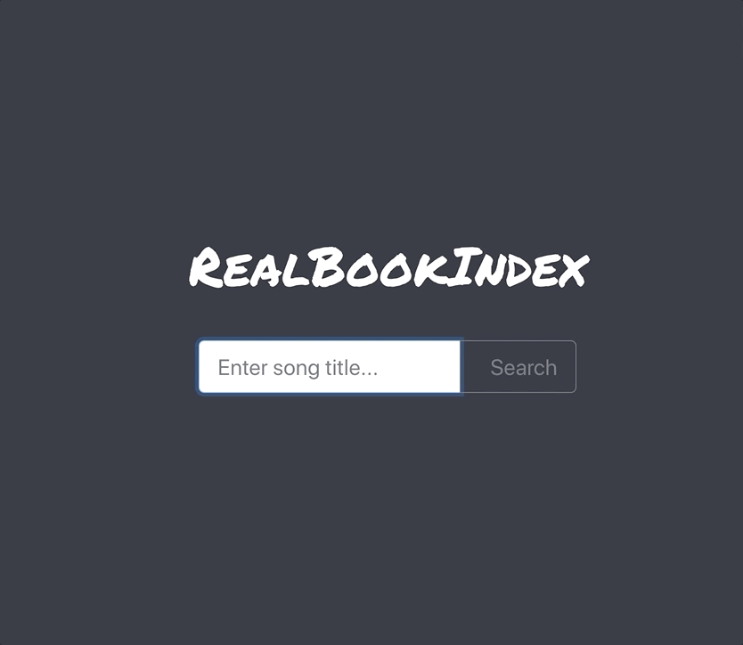

<br>

<p align="center">
  <a href="https://sam-parsons.github.io/RealBookIndex">
    
  </a>
</p>

<h1 align="center">Real Book Index</h1>

<p align="center">
  search for a jazz tune, find books that include it.
  <br>
  <a href="https://sam-parsons.github.io/RealBookIndex"><strong>Live Demo»</strong></a>
</p>

<p align="center">
    <a href="https://sam-parsons.github.io/RealBookIndex">
    
    </a>
</p>

<br>
<br>

## Installation

```sh
git clone https://github.com/sam-parsons/RealBookIndex.git

cd RealBookIndex/

yarn

yarn start
```

### [Demo](https://sam-parsons.github.io/RealBookIndex)

## License

This project is licensed under the MIT License - see the LICENSE.md file for details.
